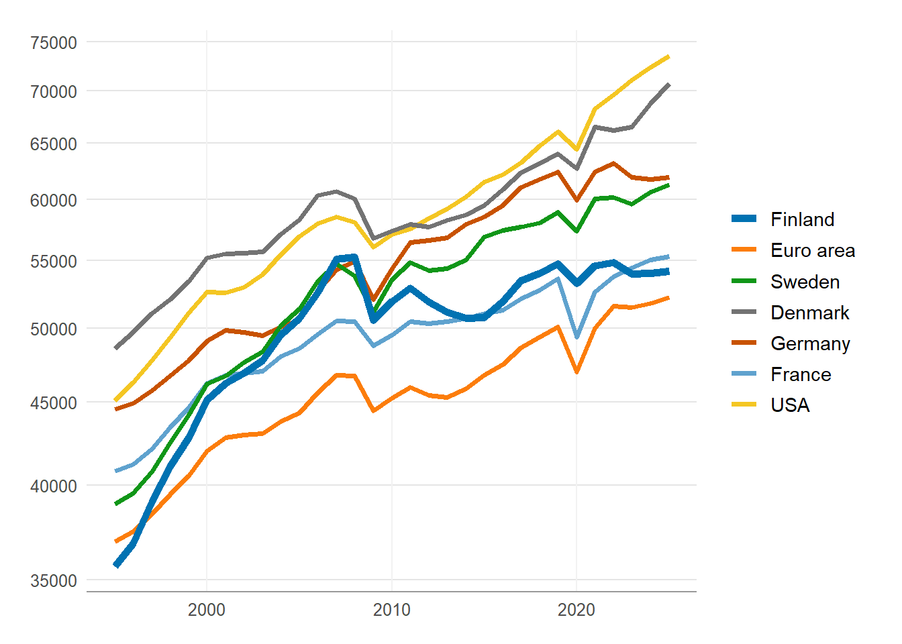
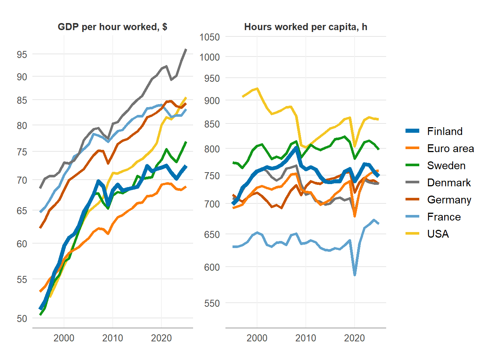
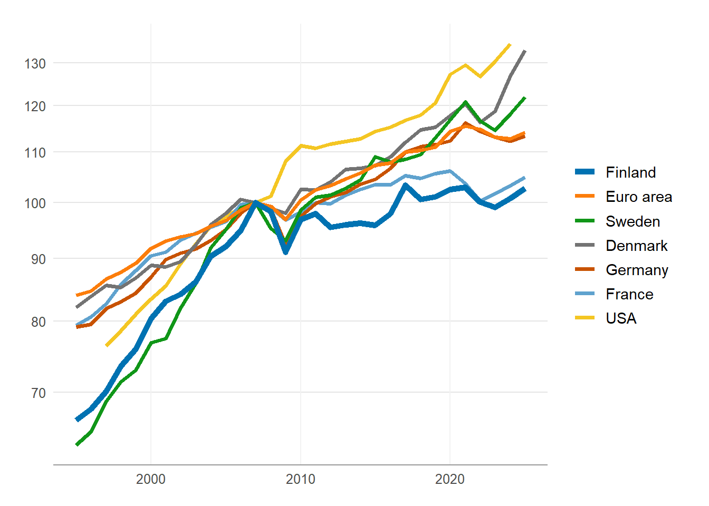
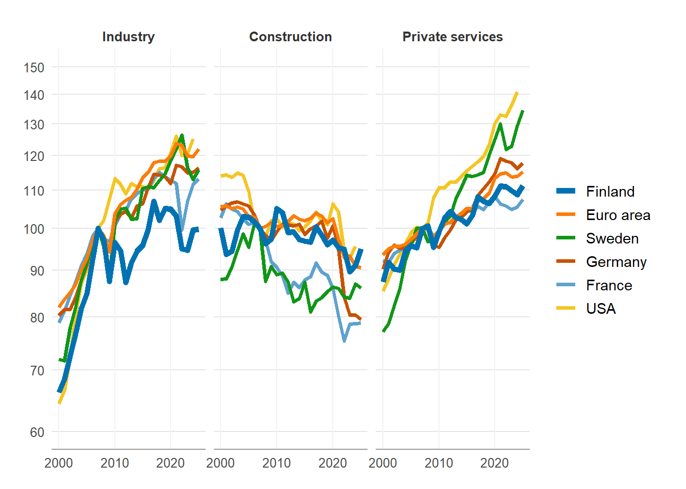
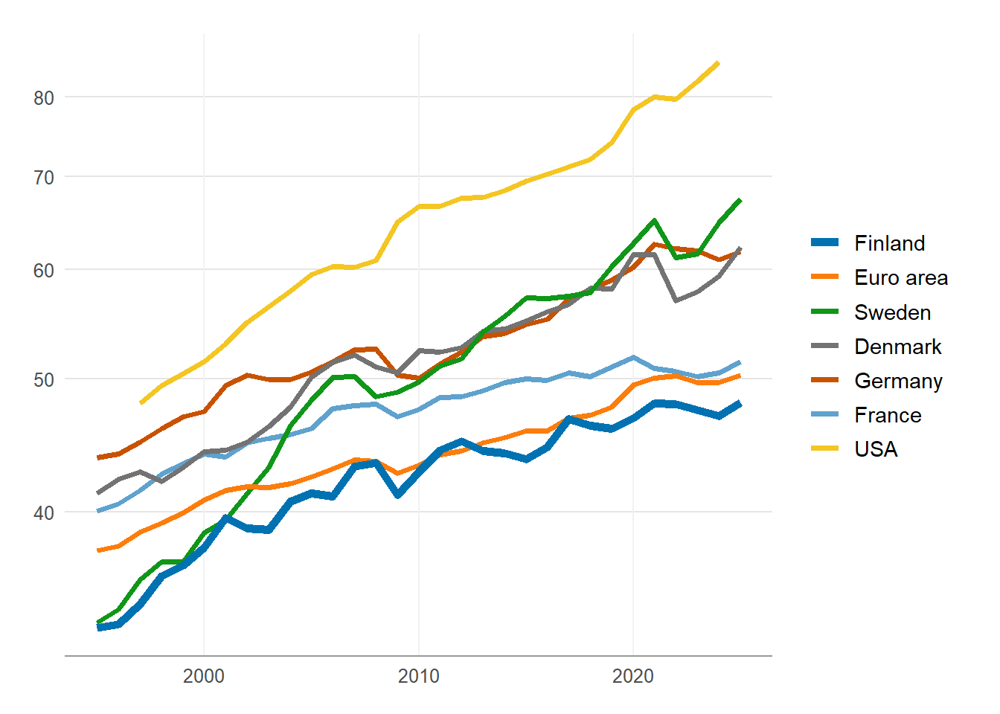
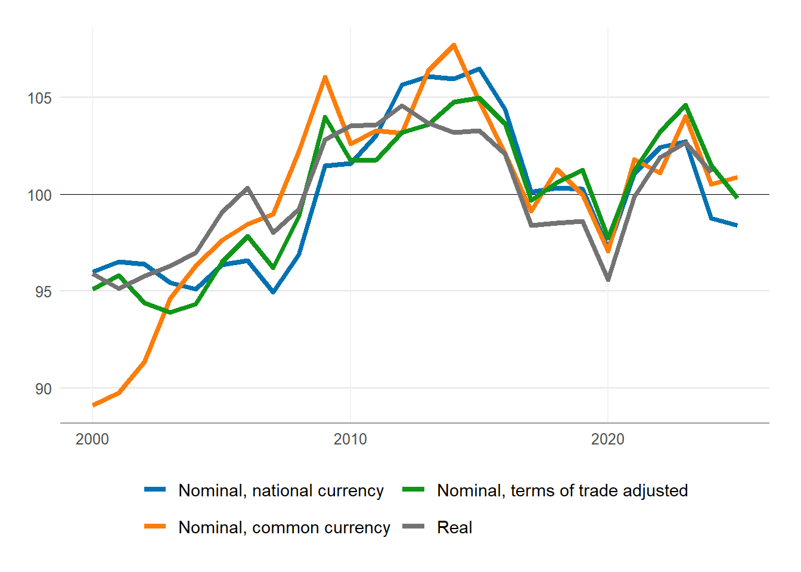
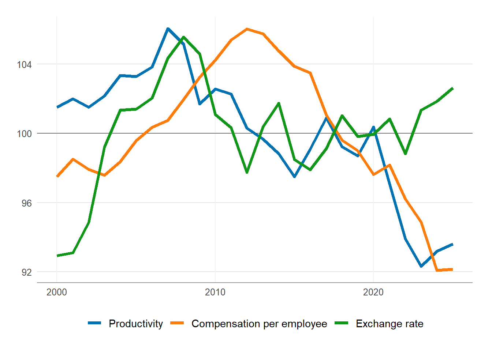
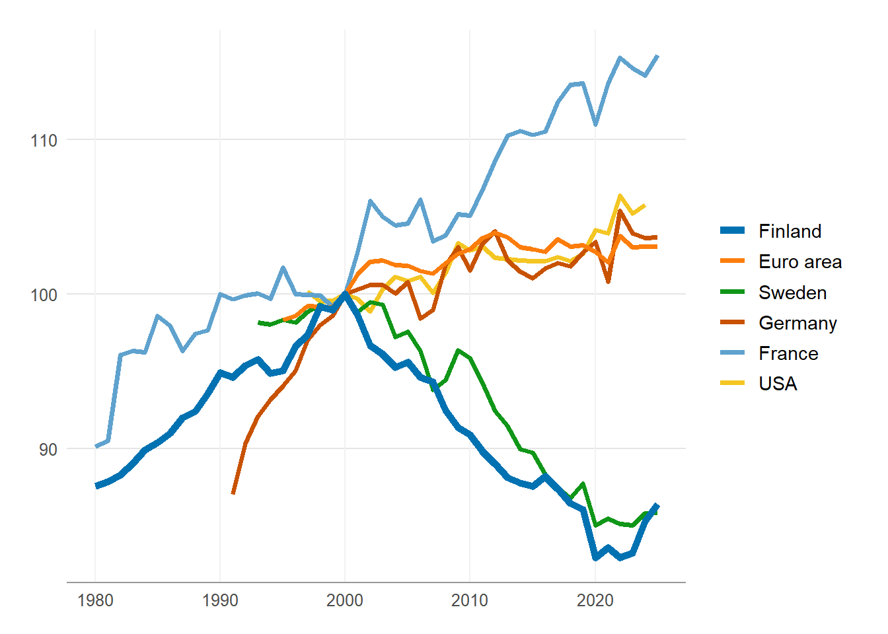
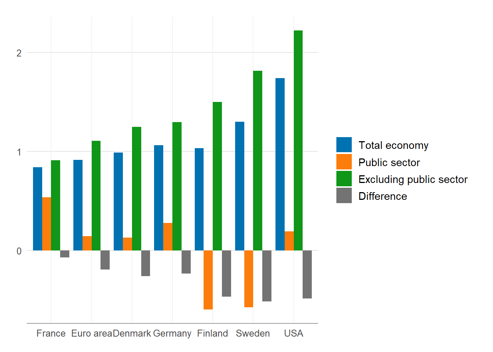

# Finnish Productivity Board report 2026

Updated: 2026-09-01

The figures of the report, in English. This is the English version of
[Tuottavuuslautakunnan raportti
2026](https://tuottavuuslautakunta.github.io/fiprod/articles/board_2026.qmd):
the same figures with the same names, but the labels and the text are in
English and the png files are written to a folder of their own
(`figures/en/<year>/` instead of `figures/<year>/`), so that the two
language versions never overwrite each other. Titles, subtitles and
sources are text above the figure, not part of the figure itself.

### The data in brief

The numbers come from the combined dataset of the package: EU and EEA
countries from Eurostat’s national accounts, the rest from the OECD
productivity database. Chain linked volumes are not additive, so
industries are summed through series in the previous year’s prices and
chained again — this is how the business sector (NACE B–N excluding real
estate) is built as well. For the OECD countries, hours worked and
persons employed are derived back from value added and labour
productivity, because the database holds neither hours nor persons on
their own. The cost competitiveness indicators are relative to 17 peer
countries, weighted with ECFIN’s trade weights.

In more detail: how the data is built and what the measures are in
[Talouskasvu ja
tuottavuus](https://tuottavuuslautakunta.github.io/fiprod/articles/main.qmd),
the difference in hours worked between the sources in [Työtunnit:
Eurostat ja
OECD](https://tuottavuuslautakunta.github.io/fiprod/articles/tyotunnit.qmd)
and the definitions of unit labour costs in
[Kustannuskilpailukyky](https://tuottavuuslautakunta.github.io/fiprod/articles/competitiveness.qmd)
(those articles are in Finnish). The code of the dataset is
`data-raw/data_main.R`.

Show the code

``` r

# library(fiprod)

if (interactive()) devtools::load_all(".") else library(fiprod) 

library(tidyverse)
library(ggcustom)
library(pttdatahaku)


set_gg(theme_fpb())


y_log_breaks <- scales::breaks_pretty(n = 8)

# The vintage data does not update unless the data files are deleted first.
vintage_year <- 2026

# Year of publication. The figures are written to figures/en/<year>/, size
# 13.5 x 13.5 cm. The other defaults of the saving (size, resolution, format,
# folder) are the defaults of save_fig() and can be changed here in the same
# call. The folder is not the one the Finnish version writes to, so the two
# language versions live side by side.
report_year <- 2026

set_fig_defaults(dir = file.path("figures", "en"), year = report_year)

dat_gdp_main <- load_dat("dat_gdp_main", vintage = vintage_year)

dat_gva_ind_comb <- load_dat("dat_gva_ind_comb", vintage = vintage_year)

geos <- rev(c(
  "Finland"       = "FI",
  "Euro area"     = "EA20",
  "Sweden"        = "SE",
  "Denmark"       = "DK",
  "Germany"       = "DE",
  "United States" = "US",
  "other"         = "Other"
))

geos_width <- set_names(if_else(geos %in% c("FI"), 2, 1.3), names(geos))
geos_colour <- set_names(c("grey80", rev(ggcustom_pal(length(geos) -1, "fpb"))), names(geos)) # grey for the "other" group


# geos_name <- set_names(names(geos), geos)

# Cost competitiveness

dat_ulc_comp     <- load_dat("dat_ulc_comp", vintage = vintage_year)
dat_oecd_pdb_ulc <- load_dat("dat_oecd_pdb_ulc", vintage = vintage_year)

start_year <- 2000

# Reference period of the index: the average of 2000 - latest = 100, as in the
# report
mean_range <- start_year:lubridate::year(max(dat_ulc_comp$time))


# Picks one or more indicators in a wide shape and rebases the index
pick <- function(vars_keep, col = "rel", geo_keep = "FI") {
  dat_ulc_comp |>
    filter(
      geo %in% geo_keep, 
      vars %in% vars_keep,
      lubridate::year(time) >= start_year) |>
    select(time, geo, vars, extended, values = all_of(col)) |>
    mutate(values = rebase_index(values, time, mean_range), .by = c(geo, vars)) |>
    mutate(vars = fct_recode(factor(vars, levels = vars_keep), !!!vars_keep))
}

sub_ind <- paste0("Index, average ", min(mean_range), "–", max(mean_range), " = 100")

# Period of the public sector comparison: the average growth rates are taken
# over these years
public_period <- 1998:2023
public_period_lab <- paste0(min(public_period), "–", max(public_period))
```

## Productivity

### GDP per capita, difference in levels

GDP relative to population. In 2020 \$, adjusted for purchasing power
(log scale). Source: Eurostat, OECD, Finnish Productivity Board.

Show the code

``` r

p <- dat_gdp_main |>
  filter(time >= "1995-01-01") |> 
  filter_recode(
    geo = geos,
    measure = c("GDPPOP"),
    activity = c("Total economy" = "_T"),
    price_base = c("LR"),        # 
    conversion_type = c("PPP")
  ) |> 
  # mutate(geo2 = suppressWarnings(fct_relevel(geo, geos, after = Inf))) |>
  # mutate(geo = fct_other(geo, keep = geos, other_level = "Other")) |> 
  # filter_recode(geo = geos) |> 
  select(-unit_measure) |> 
  ggplot(aes(time, values, colour = geo, linewidth = geo)) +
  geom_line() +
  scale_colour_manual(values = geos_colour) +
  scale_linewidth_manual(values = geos_width) +
  scale_y_log10(breaks = y_log_breaks) +
  guides(colour = guide_legend(reverse = TRUE), linewidth = guide_legend(reverse = TRUE)) +
  the_title_blank("xyl")

save_fig(p, "bkt-per-capita")
```



Figure 1

Eurostat does not publish series adjusted for purchasing power, so the
conversion is made with the OECD’s own conversion factors. They are not
available for every year, in which case the nearest available factor is
carried forward.

### GDP per capita, decomposition

Labour productivity and hours worked. GDP per hour worked in 2020 \$,
adjusted for purchasing power, and hours worked per capita (log scale).
Source: Eurostat, OECD, Finnish Productivity Board.

Show the code

``` r

pdat <- dat_gdp_main |>
  filter(time >= "1995-01-01") |> 
  filter_recode(
    geo = geos,
    measure = c("GDP", "HRS", "HRSPOP", "EMP", "POP", "WAP"),
    activity = c("Total economy" = "_T"),
    unit_measure = c("USD_PPP", "H", "H_PS", "PS"),
    price_base = c("LR", "_Z"),        
    conversion_type = c("PPP", "_Z")
  ) |> 
  select(time, geo, measure, values) |> 
  pivot_wider(names_from = "measure", values_from = "values") |> 
  mutate(
    time = time,
    geo = geo,
    "GDP per hour worked, $" = 1000 * GDP / HRS,
    "Hours worked per capita, h" = HRS / POP,
    .keep = "none") |> 
  pivot_longer(!c("time", "geo"), names_to = "measure", values_to = "values")

# the scales right in relation to the effect
rng <- pdat |>
  summarise(lo = min(values, na.rm = TRUE), hi = max(values, na.rm = TRUE), .by = measure) |>
  mutate(dec = max(log10(hi / lo)),          # the widest span in decades
         mid = sqrt(lo * hi),                # the geometric midpoint
         lo  = mid / 10^(dec / 2),
         hi  = mid * 10^(dec / 2)) |>
  select(measure, lo, hi) |>
  pivot_longer(c(lo, hi), values_to = "values") |>
  mutate(time = min(pdat$time))

p <- ggplot(pdat, aes(time, values, colour = geo, linewidth = geo)) +
  geom_blank(data = rng, aes(time, values), inherit.aes = FALSE) +
  facet_wrap(~measure, scales = "free") +
  scale_y_log10(breaks = y_log_breaks) +
  geom_line() +
  scale_colour_manual(values = geos_colour) +
  scale_linewidth_manual(values = geos_width) +
  guides(colour = guide_legend(reverse = TRUE), linewidth = guide_legend(reverse = TRUE)) +
  the_title_blank("xyl")

save_fig(p, "bkt-per-capita-hajotelma")
```



Figure 2

For the OECD countries, hours worked are derived back from value added
and labour productivity. The OECD replaces the national accounts hours
of ten countries with an estimate of its own, which shifts the level of
hours and thus of productivity but hardly the growth rates; see
[Työtunnit: Eurostat ja
OECD](https://tuottavuuslautakunta.github.io/fiprod/articles/tyotunnit.qmd).

### Labour productivity growth in the business sector

Labour productivity, value added per hour worked. Business sector, index
2007 = 100 (log scale). Source: Eurostat, OECD, Finnish Productivity
Board.

Show the code

``` r

p <- dat_gva_ind_comb |>
  filter(time >= "1995-01-01") |> 
  filter_recode(
    measure = c("GVAHRS"),
    activity = c("Business sector" = "BTNXL"),
    vars = c("fp_2020_lc")
  ) |> 
  mutate(values = rebase(values, time, baseyear = 2007), .by = where(is.factor)) |> 
  # filter(geo != "DK") |> 
  filter_recode(
    geo = geos
  ) |> 

  ggplot(aes(time, values, colour = geo, linewidth = geo)) +
  # facet_wrap(~ activity, nrow = 1) +
  geom_line() +
  scale_colour_manual(values = geos_colour) +
  scale_linewidth_manual(values = geos_width) +
  scale_y_log10(breaks = y_log_breaks) +
  guides(colour = guide_legend(reverse = TRUE), linewidth = guide_legend(reverse = TRUE)) +
  the_title_blank("xyl")

save_fig(p, "tuottavuus-yrityssektori")
```



Figure 3

The business sector is NACE B–N excluding real estate (L). For the
Eurostat countries it is summed from the A\*10 industries through series
in the previous year’s prices and chained again; for the OECD countries
it comes ready from the database (`BTNXL`). The series are in national
currency, so the figure shows growth, not the difference in levels.

### Labour productivity growth in industry and in services

Labour productivity by industry, value added per hour worked. Index 2007
= 100 (log scale). Source: Eurostat, OECD, Finnish Productivity Board.

Show the code

``` r

p <- dat_gva_ind_comb|>
  filter(time >= "2000-01-01") |> 
  filter_recode(
    measure = c("GVAHRS"),
    activity = c("Industry" = "BTE", "Construction" = "F", "Private services" = "GTNXL"),
    vars = c("fp_2020_lc")
  ) |> 
  mutate(values = rebase(values, time, baseyear = 2007), .by = where(is.factor)) |> 
  filter(geo != "DK") |>
  filter_recode(
    geo = geos
  ) |> 

  ggplot(aes(time, values, colour = geo, linewidth = geo)) +
  scale_y_log10(limits = c(60, 150), breaks = y_log_breaks) +
  facet_wrap(~ activity) +
  geom_line() +
  scale_colour_manual(values = geos_colour) +
  scale_linewidth_manual(values = geos_width) +
  guides(colour = guide_legend(reverse = TRUE), linewidth = guide_legend(reverse = TRUE)) +
  the_title_blank("xyl")

save_fig(p, "tuottavuus-toimialat")
```



Figure 4

In the OECD industry data, industry (B–E) covers manufacturing only,
which concerns the countries that come from the OECD; see [Talouskasvu
ja
tuottavuus](https://tuottavuuslautakunta.github.io/fiprod/articles/main.qmd).

### The level of productivity in services

Labour productivity in services, value added per hour worked in 2017 \$,
adjusted for purchasing power (log scale). Source: Eurostat, OECD,
Finnish Productivity Board.

Show the code

``` r

p <- dat_gva_ind_comb|> 
  filter(time >= "1995-01-01") |> 
  filter_recode(
    measure = c("GVAHRS"),
    activity = c("Private services" = "GTNXL"),
    vars = c("fp_2020_ppp17")
  ) |> 
  # mutate(values = rebase(values, time, baseyear = 2007), .by = where(is.factor)) |> 
  filter_recode(
    geo = geos
  ) |> 
  ggplot(aes(time, values, colour = geo, linewidth = geo)) +
  scale_y_log10(limits = c(50, 150), breaks = y_log_breaks) +
  geom_line() +
  scale_colour_manual(values = geos_colour) +
  scale_linewidth_manual(values = geos_width) +
  scale_y_log10(breaks = y_log_breaks) +
  guides(colour = guide_legend(reverse = TRUE), linewidth = guide_legend(reverse = TRUE)) +
  the_title_blank("xyl") 

save_fig(p, "tuottavuustaso-palvelut")
```



Figure 5

## Cost competitiveness

### Unit cost indicators

Finland’s relative unit labour cost on different definitions. Index,
average 2000–2025 = 100. Source: Eurostat, Finnish Productivity Board.

Show the code

``` r

p <- pick(c("Nominal, national currency" = "nulc_aper",
            "Nominal, common currency" = "nulc_aper_eur",
            "Nominal, terms of trade adjusted" = "nulc_aper_eur_atot",
            "Real" = "rulc_aper")) |>
  ggplot(aes(time, values, colour = vars)) +
  geom_hline(yintercept = 100, linewidth = 0.3) +
  geom_line() +
  the_title_blank("xl") +
  the_legend_bot() +
  guides(colour = guide_legend(nrow = 2)) +
  labs(y = NULL)

save_fig(p, "ulc-maaritelmat")
```



Figure 6

The ratio is computed against 17 peer countries, except the terms of
trade adjusted one, which is against the 15 Eurostat countries only: the
OECD productivity database holds neither exports nor imports. The last
years of the United States and Japan are extended with the growth rate
of the OECD quarterly series, so the final year rests in part on
extended data (the `extended` column).

### Decomposition of the ULC

The components of the relative unit labour cost. Index, average
2000–2025 = 100. Source: Eurostat, Finnish Productivity Board.

Show the code

``` r

p <- pick(c("Productivity" = "lp_ind",
            "Compensation per employee" = "d1_per_ind",
            "Exchange rate" = "exch_eur_ind")) |>
  mutate(values = if_else(vars == "Exchange rate", 100^2 / values, values)) |>
  ggplot(aes(time, values, colour = vars)) +
  geom_hline(yintercept = 100, linewidth = 0.3) +
  geom_line() +
  the_title_blank("xl") +
  the_legend_bot() +
  labs(y = NULL)

save_fig(p, "ulc-hajotelma")
```



Figure 7

The exchange rate index is national currency per euro, so a rise in it
means the currency weakening. In the figure it is turned around (100² /
index), so that a rise is the currency strengthening and therefore the
unit labour cost rising in the common currency. A rise in compensation
raises the unit labour cost, a rise in productivity lowers it.

## Productivity in the public sector

The public sector is three industries taken together here: public
administration, education, and health and social work (NACE O–Q). They
also contain private sector output, health services especially, because
no comprehensive cross country data is available on a sector breakdown
alone. The industries separately, and a version based on the OECD data
alone, are in [Julkisen sektorin
tuottavuus](https://tuottavuuslautakunta.github.io/fiprod/articles/public.qmd)
(in Finnish).

### Productivity in the public sector

Labour productivity in the public sector, value added per hour worked in
2020 \$, adjusted for purchasing power. Index, 2000 = 100. Source:
Eurostat, OECD, Finnish Productivity Board.

Show the code

``` r

p <- dat_gva_ind_comb |>
  filter(time >= "1995-01-01") |> 
  filter_recode(
    measure = c("GVAHRS"),
    activity = c("Public sector" = "OTQ"),
    vars = c("fp_2020_ppp17")
  ) |> 
  mutate(values = rebase(values, time, baseyear = 2000), .by = where(is.factor)) |> 
  filter(geo != "DK") |> 
  filter_recode(
    geo = geos
  ) |> 
  ggplot(aes(time, values, colour = geo, linewidth = geo)) +
  geom_line() +
  scale_colour_manual(values = geos_colour) +
  scale_linewidth_manual(values = geos_width) +
  guides(colour = guide_legend(reverse = TRUE), linewidth = guide_legend(reverse = TRUE)) +
  the_title_blank("xyl")

save_fig(p, "tuottavuus-julkinen")
```



Figure 8

Eurostat’s data is retrieved at the A\*10 level of NACE, where public
administration, education, and health and social work are one industry
(`OTQ`); for the OECD countries the same aggregate is summed from the
industries. The purchasing power adjustment is industry specific and
based on the 2017 price level, so the figure compares growth, not
levels.

### Productivity growth with and without the public sector

Average annual growth of labour productivity in the total economy, in
the public sector and excluding the public sector, and the difference
between the growth rates of the total economy and of the economy
excluding the public sector. Average over 1998–2023, %. Source:
Eurostat, OECD, Finnish Productivity Board.

Show the code

``` r

# Chain linked volumes are not additive, so the public sector is subtracted from
# the total economy through series in the previous year's prices and the
# difference is chained again. Hours worked are additive and are subtracted as
# they are.
pdat <- dat_gva_ind_comb |> 
  filter(time >= "1995-01-01") |> 
  filter_recode(
    measure = c("GVA", "HRS"),
    activity = c("TOT" = "_T", "OTQ"),
    vars = c("cp", "fp_2020_lc")
  ) |> 
  pivot_wider(names_from = c(measure, vars), values_from = values, names_sep = "__") |> 
  select(-HRS__fp_2020_lc) |> 
  mutate(GVA__pp = prev_year_prices(GVA__cp, GVA__fp_2020_lc, time), .by = c(geo, activity)) |> 
  pivot_wider(
    names_from = activity,
    values_from = where(is.numeric),
    names_sep = "___"
  ) |> 
  mutate(
    GVA__cp___TOTex = GVA__cp___TOT - GVA__cp___OTQ,
    HRS__cp___TOTex = HRS__cp___TOT - HRS__cp___OTQ,
    GVA__pp___TOTex = GVA__pp___TOT - GVA__pp___OTQ
  ) |> 
  mutate(GVA__fp_2020_lc___TOTex = fixed_prices(GVA__cp___TOTex, GVA__pp___TOTex, time, 2020), .by = geo) |> 
  pivot_longer(cols = where(is.numeric), names_to = c("vars", "activity"), names_sep = "___",
               values_to = "values", names_transform = as_factor) |> 
  pivot_wider(names_from = "vars", values_from = "values") |> 
  mutate(GVAHRS__fp_2020_lc = GVA__fp_2020_lc / HRS__cp) |> 
  pivot_longer(cols = where(is.numeric), names_to = c("measure", "vars"), names_sep = "__",
               values_to = "values", names_transform = as_factor)

p <- pdat |> 
  filter_recode(
    measure = "GVAHRS",
    vars = "fp_2020_lc",
    geo = geos
  ) |> 
  mutate(values = pc(values, 1, time), .by = c(geo, activity)) |> 
  pivot_wider(names_from = activity, values_from = values) |> 
  mutate(diff = TOT - TOTex) |> 
  pivot_longer(cols = where(is.numeric), names_to = "activity", values_to = "values",
               names_transform = as_factor) |> 
  filter_recode(
    activity =
      c("Total economy" = "TOT",
        "Public sector" = "OTQ",
        "Excluding public sector" = "TOTex",
        "Difference" = "diff")
  ) |> 
  filter(year(time) %in% public_period) |> 
  summarise(values = mean(values), .by = c(geo, activity)) |> 
  mutate(geo = fct_reorder(geo, values, .fun = max)) |> 
  ggplot(aes(geo, values, fill = activity)) +
  geom_col(position = "dodge") +
  the_title_blank("xyl")

save_fig(p, "tuottavuuskasvu-julkinen")
```



Figure 9

The difference tells how much the public sector has slowed down (a
negative number) or sped up the productivity growth of the total
economy, compared with an economy from which the public sector has been
removed. The average is taken without any correction for missing years,
so a country drops out of the figure if even one year of the period is
missing. Value added excluding the public sector is chained again to
2020 prices in national currency; see [Talouskasvu ja
tuottavuus](https://tuottavuuslautakunta.github.io/fiprod/articles/main.qmd).
