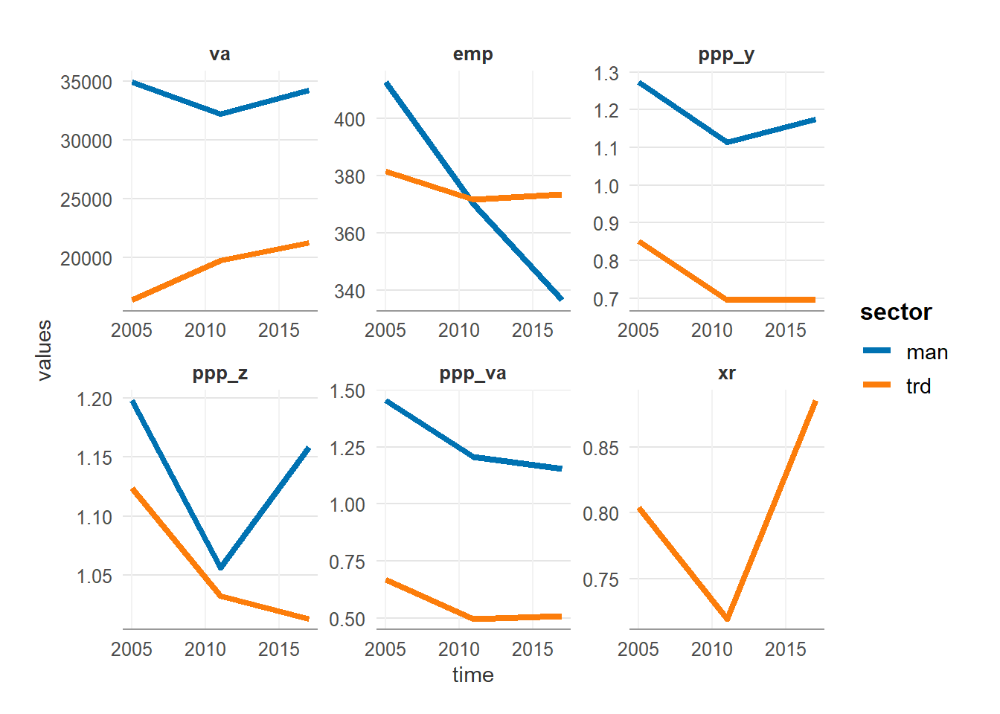
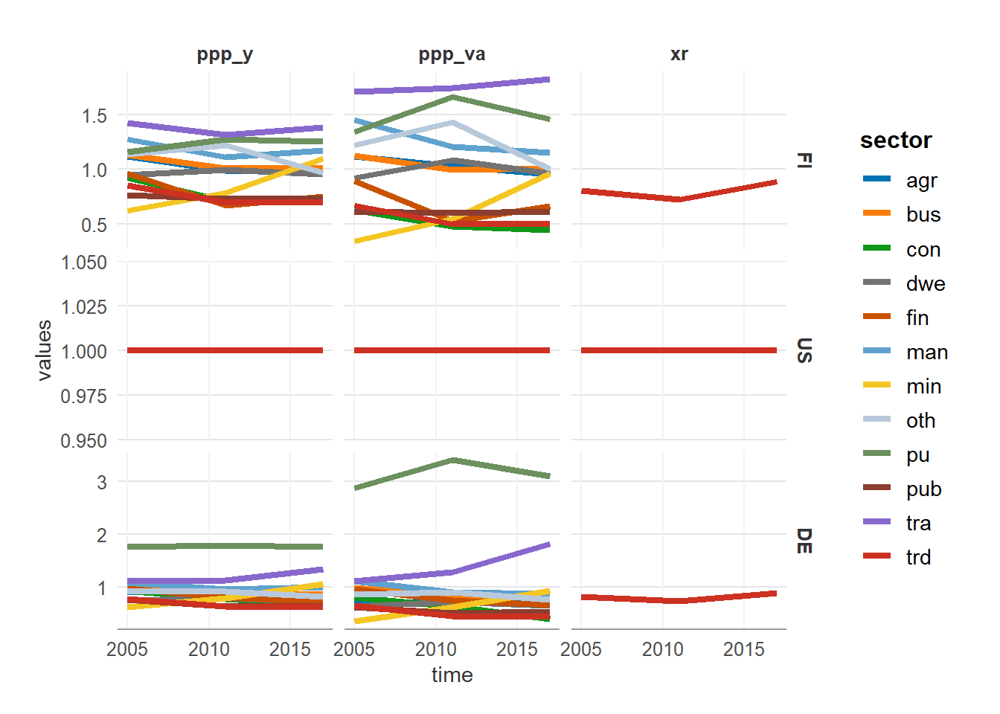
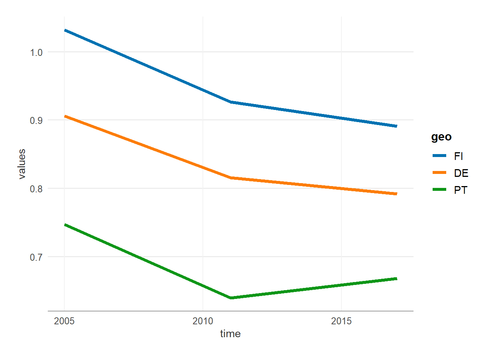

# GGDC data

Näytä koodi

``` r

# library(fiprod)

if (interactive()) devtools::load_all(".") else library(fiprod) 

library(tidyverse)
library(ggcustom)
library(pttdatahaku)


set_gg(theme_fpb(), "fpb")

dat_ggdc_23 <- load_dat("dat_ggdc_23")

geos <- c("FI", "SE", "US", "EA20", "DK", "DE")
```

Näytä koodi

``` r

dat_ggdc_23 |> 
  filter_recode(
    geo = "FI",
    sector = c("man", "trd")
  ) |> 
  ggplot(aes(time, values, colour = sector)) +
  facet_wrap(~vars, scales = "free") +
  geom_line()
```



Näytä koodi

``` r

dat_ggdc_23 |> 
  filter_recode(
    geo = c("FI", "US", "DE"),
    # sector = c("man", "trd", "bus", "con"),
    vars = c("ppp_x", "ppp_y", "ppp_va", "xr") 
  ) |> 
  ggplot(aes(time, values, colour = sector)) +
  facet_grid(geo~vars, scales = "free") +
  geom_line()
```



Näytä koodi

``` r

dat_ggdc_23 |> 
  filter_recode(vars = c("va", "ppp_va"),
                geo = c("FI", "DE", "PT")) |> 
  spread(vars, values) |> 
  group_by(time, geo) |> 
  summarise(values = weighted.mean(ppp_va, va)) |> 
  ungroup() |> 
  ggplot(aes(time, values, colour = geo)) +
  geom_line()
```


