# Talouskasvu ja tuottavuus

KESKEN

Päivitetty: 2026-09-01

Näytä koodi

``` r

# library(fiprod)

if (interactive()) devtools::load_all(".") else library(fiprod) 

library(tidyverse)
library(ggcustom)
library(pttdatahaku)


set_gg(theme_fpb())

y_log_breaks <- scales::breaks_pretty(n = 8)


dat_gdp_main <- load_dat("dat_gdp_main")

dat_gva_ind_comb <- load_dat("dat_gva_ind_comb")

geos <- rev(c(
  "Suomi"         = "FI",
  "Euroalue"      = "EA20",
  "Ruotsi"        = "SE",
  "Tanska"        = "DK",
  "Saksa"         = "DE",
  "USA"           = "US",
  "muut"          = "Other"
))

geos_width <- set_names(if_else(geos %in% c("FI"), 2, 1.3), names(geos))
geos_colour <- set_names(c("grey80", rev(ggcustom_pal(length(geos) -1, "fpb"))), names(geos)) # muut luokalle harmaa


# geos_name <- set_names(names(geos), geos)
```

## Talouskasvun ja tuottavuuskehityksen tiedot

Päälähteenä käytetty [OECD productivity
database](https://data-explorer.oecd.org/vis?fs%5B0%5D=Topic%2C1%7CEconomy%23ECO%23%7CProductivity%23ECO_PRO%23&pg=0&fc=Topic&bp=true&snb=7&df%5Bds%5D=dsDisseminateFinalDMZ&df%5Bid%5D=DSD_PDB%40DF_PDB&df%5Bag%5D=OECD.SDD.TPS&df%5Bvs%5D=2.0&dq=.A.GVAHRS._T.XDC_H..N..&lom=LASTNPERIODS&lo=5&to%5BTIME_PERIOD%5D=false&isAvailabilityDisabled=false):n
tietoja ([tietokannan
uudistus](https://www.oecd.org/en/publications/the-revamp-of-the-oecd-productivity-database_f07c55d4-en.html)
ja
[metadata](https://www.oecd.org/content/dam/oecd/en/data/methods/OECD-Productivity-Statistics-Database-metadata.pdf)).

Toimialoille hintatasotiedot ovat [GGDC Productivity
level](https://www.rug.nl/ggdc/productivity/pld/) tietokannasta.

OECD:n tietokanta päivittyy kuitenkin selvästi Eurostatia hitaammin,
joten tässä käytetään yhdistettyä aineistoa: EU- ja ETA-maiden tiedot
ovat Eurostatin kansantalouden tilinpidosta (`nama_10_a10`,
`nama_10_a10_e`, `nama_10_gdp` ja `nama_10_pc`) ja muiden maiden (US,
JP, UK) OECD:ltä. Toimialat ovat NACE:n A\*10-tasolla, ja OECD:n
yrityssektori `BTNXL` (toimialat B–N pl. L) on laskettu Eurostatin
toimialoista edellisen vuoden hintaisten sarjojen kautta, koska
kiinteähintaisia sarjoja ei voi laskea yhteen. Ostovoimapariteetit ovat
OECD:n omia. `source`-sarake kertoo, kummasta lähteestä kunkin maan
tiedot ovat. Pelkkään OECD:n aineistoon perustuva versio on
`main_oecd.qmd`.

Työtuntien osalta lähteet poikkeavat toisistaan kymmenellä maalla, mikä
siirtää työn tuottavuuden **tasoa** mutta ei juuri kasvuvauhtia. Ks.
`tyotunnit.qmd`.

Taulut ovat `dat_gdp_main` (koko talous) ja `dat_gva_ind_comb`
(toimialat).

## BKT:n kasvu

Näytä koodi

``` r

# OECD koodit:
# 
# V Käypähintainen
# 
# LR perusvuosi 2020 (lisäksi L, jossa perusvuosi vaihteleva).

dat_gdp_main |> 
  filter(time >= "1995-01-01") |> 
  filter_recode(
    geo = geos,
    measure = c("GDPPOP"),
    activity = c("Koko talous" = "_T"),
    price_base = c("LR"),        # 
    conversion_type = c("PPP")
  ) |> 
  select(-unit_measure) |> 
  mutate(values = rebase(values, time, baseyear = 2007), .by = where(is.factor)) |>  
  ggplot(aes(time, values, colour = geo, linewidth = geo)) +
  geom_line() +
  scale_linewidth_manual(values = geos_width) +
  scale_colour_manual(values = geos_colour) +
  guides(colour = guide_legend(reverse = TRUE), 
         linewidth = guide_legend(reverse = TRUE)) +
  scale_y_log10(breaks = y_log_breaks) +
  the_title_blank("xyl") +
  labs(
    title = "BKT per capita",
    subtitle = "Indeksi, 2007 = 100 (log-asteikko)",
    caption = "Lähde: Eurostat, OECD, Tuottavuuslautakunta"
  )
```

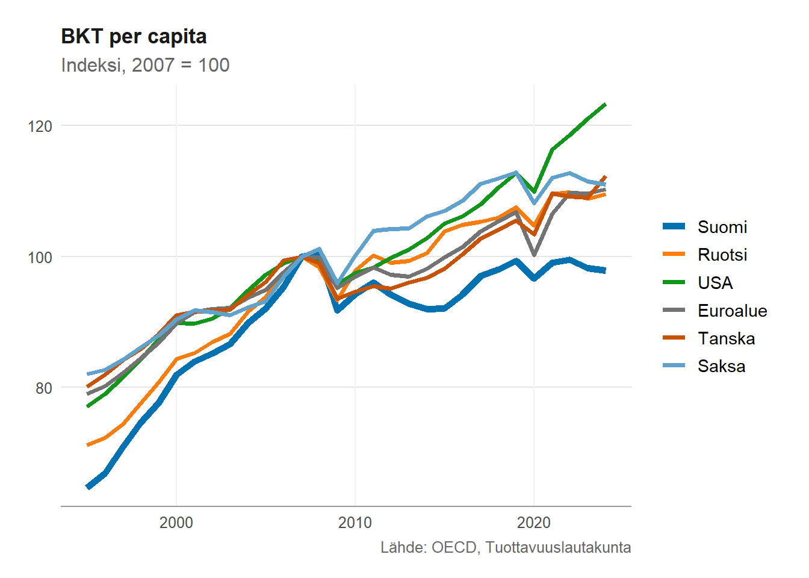

## BKT:n kasvu jaettuna työn tuottavuuteen ja työtunteihin koko taloudessa

Näytä koodi

``` r

dat_gdp_main |> 
  filter(time >= "1995-01-01") |> 
  filter_recode(
    geo = geos,
    measure = c("Työn tuottavuus" = "GVAHRS", "Tunnit per capita" = "HRSPOP"),
    activity = c("Koko talous" = "_T"),
    unit_measure = c("USD_PPP_H", "H_PS"),
    price_base = c("LR", "_Z"),        
    conversion_type = c("PPP", "_Z")
  ) |> 
  select(-unit_measure) |> 
  mutate(values = rebase(values, time, baseyear = 2007), .by = where(is.factor)) |> 
  ggplot(aes(time, values, colour = geo, linewidth = geo)) +
  facet_wrap(~measure) +
  geom_line() +
  scale_colour_manual(values = geos_colour) +
  scale_linewidth_manual(values = geos_width) +
  scale_y_log10(breaks = y_log_breaks) +
  guides(colour = guide_legend(reverse = TRUE), linewidth = guide_legend(reverse = TRUE)) +
  the_title_blank("xyl") +
  labs(
    title = "BKT per capita",
    subtitle = "Indeksi, 2007 = 100 (log-asteikko)",
    caption = "Lähde: Eurostat, OECD, Tuottavuuslautakunta"
  )
```

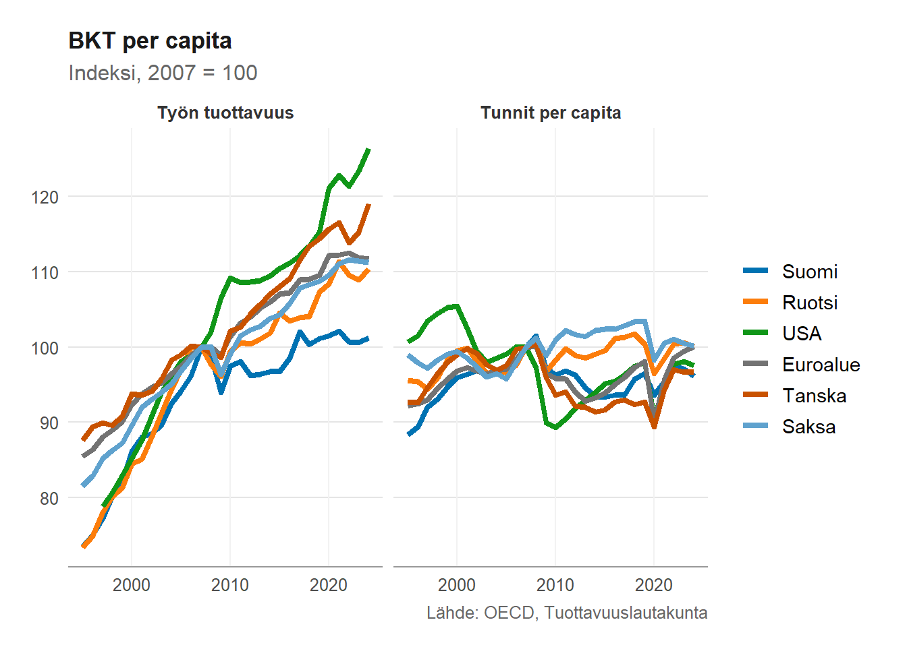

## Työn tuottavuuden kasvu koko taloudessa ja yrityssektorilla

Yrityssektorilla viittaan tässä toimialoihin B-N pl. L. Niillä
tuottavuuden mittaaminen on vähemmän ongelmallista kuin pois jätetyillä
toimialoilla.

Näytä koodi

``` r

dat_gva_ind_comb |> 
  filter(time >= "1995-01-01") |> 
  filter_recode(
    measure = c("GVAHRS"),
    activity = c("Koko talous" = "_T", "Yrityssektori" = "BTNXL"),
    vars = c("fp_2020_ppp17")
  ) |> 
  mutate(values = rebase(values, time, baseyear = 2007), .by = where(is.factor)) |> 
  filter(geo != "DK") |> 
  filter_recode(
    geo = geos
  ) |> 

  ggplot(aes(time, values, colour = geo, linewidth = geo)) +
  facet_wrap(~ activity, nrow = 1) +
  geom_line() +
  scale_colour_manual(values = geos_colour) +
  scale_linewidth_manual(values = geos_width) +
  scale_y_log10(breaks = y_log_breaks) +
  guides(colour = guide_legend(reverse = TRUE), linewidth = guide_legend(reverse = TRUE)) +
  the_title_blank("xyl") +
  labs(
    title = "Työn tuottavuus, arvonlisä / työtunnit",
    subtitle = "Indeksi, 2007 = 100 (log-asteikko)",
    caption = "Lähde: Eurostat, OECD, Tuottavuuslautakunta"
  )
```

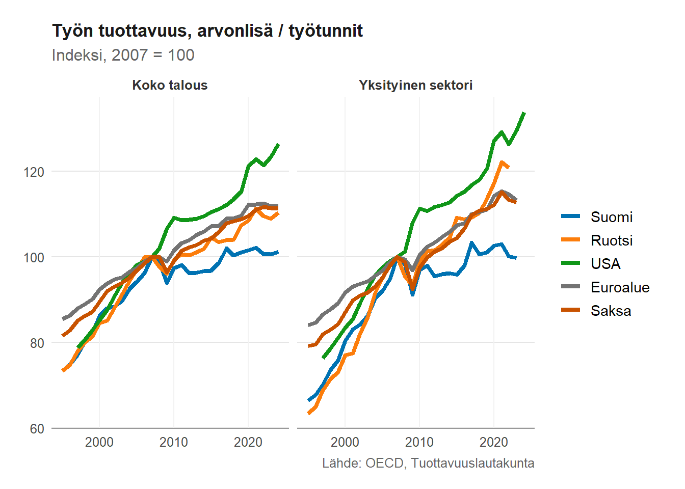

### Muut kuin yrityssektorin toimialat

Näillä toimialoilla on monia tuottavuuden mittaamiseen liityviä
ongelmia. Kts. esim. Tuottavuuslautakunta (2019).

Näytä koodi

``` r

dat_gva_ind_comb |> 
  filter(time >= "1995-01-01") |> 
  filter_recode(
    measure = c("GVAHRS"),
    activity = c("A" = "Alkutuotanto", "Kiinteistöala" = "L", "Julkinen" = "OTQ", "Muut palvelut" = "RTU"),
    vars = c("fp_2020_ppp17")
  ) |> 
  mutate(values = rebase(values, time, baseyear = 2007), .by = where(is.factor)) |> 
  filter(geo != "DK") |> 
  filter_recode(
    geo = geos
  ) |> 

  ggplot(aes(time, values, colour = geo, linewidth = geo)) +
  facet_wrap(~ activity, nrow = 1) +
  geom_line() +
  scale_colour_manual(values = geos_colour) +
  scale_linewidth_manual(values = geos_width) +
  scale_y_log10(breaks = y_log_breaks) +
  guides(colour = guide_legend(reverse = TRUE), linewidth = guide_legend(reverse = TRUE)) +
  the_title_blank("xyl") +
  labs(
    title = "Työn tuottavuus, arvonlisä / työtunnit",
    subtitle = "Indeksi, 2007 = 100 (log-asteikko)",
    caption = "Lähde: Eurostat, OECD, Tuottavuuslautakunta"
  )
```

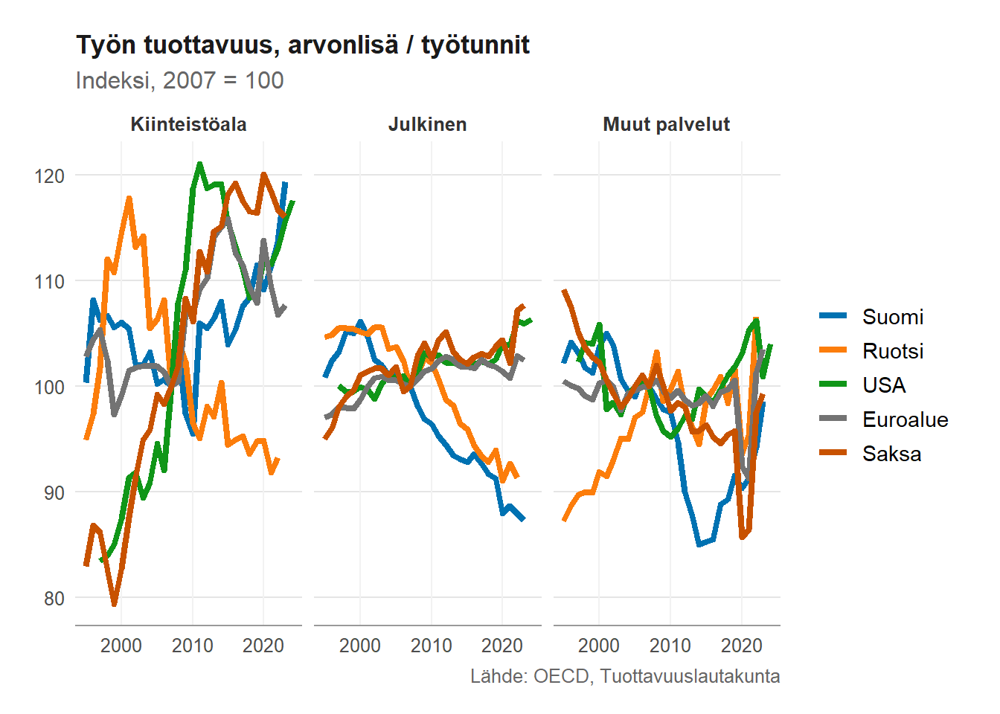

### Yrityssektori jaettuna

Näytä koodi

``` r

dat_gva_ind_comb|> 
  filter(time >= "1995-01-01") |> 
  filter_recode(
    measure = c("GVAHRS"),
    activity = c("Teollisuus" = "BTE", "Rakentaminen" = "F","Yksityiset palvelut" = "GTNXL"),
    vars = c("fp_2020_ppp17")
  ) |> 
  mutate(values = rebase(values, time, baseyear = 2007), .by = where(is.factor)) |> 
  filter(geo != "DK") |> 
  filter_recode(
    geo = geos
  ) |> 

  ggplot(aes(time, values, colour = geo, linewidth = geo)) +
  scale_y_log10(limits = c(50, 150), breaks = y_log_breaks) +
  facet_wrap(~ activity) +
  geom_line() +
  scale_colour_manual(values = geos_colour) +
  scale_linewidth_manual(values = geos_width) +
  guides(colour = guide_legend(reverse = TRUE), linewidth = guide_legend(reverse = TRUE)) +
  the_title_blank("xyl") +
  labs(
    title = "Työn tuottavuus, arvonlisä / työtunnit",
    subtitle = "Indeksi, 2007 = 100 (log-asteikko)",
    caption = "Lähde: Eurostat, OECD, Tuottavuuslautakunta"
  )
```

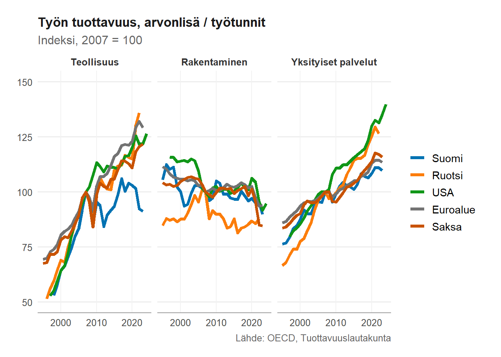

### Osuudet

Näytä koodi

``` r

dat_gva_ind_comb |> 
  filter(time >= "1995-01-01") |> 
  filter_recode(
    measure = c("GVA"),
    activity = c("_T", "BTNXL", "L", "OTQ", "RTU"),
    vars = c("cp")
  ) |> 
  mutate(values = 100 * values / values[activity == "_T"] , .by = !c(activity, values)) |> 
  filter_recode(
    geo = geos,
    activity = c("Yrityssektori" = "BTNXL", "Kiinteistöala" = "L", "Julkinen" = "OTQ", "Muut palvelut" = "RTU")) |> 
  ggplot(aes(time, values, colour = activity)) +
  facet_wrap(~ geo, nrow = 1) +
  geom_line() +
  scale_x_date(date_labels = "%y") +
  the_title_blank("xyl") +
  labs(
    title = "Osuus arvonlisäyksestä",
    subtitle = "%",
    caption = "Lähde: Eurostat, OECD, Tuottavuuslautakunta"
  ) 
```

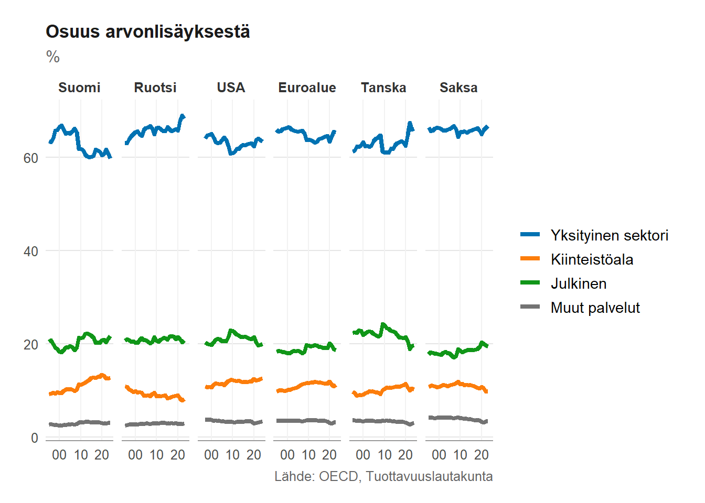

Näytä koodi

``` r

dat_gva_ind_comb |> 
  filter(time >= "1995-01-01") |> 
  filter_recode(
    measure = c("GVA"),
    activity = c("_T", "A", "BTE", "F", "GTNXL", "L", "OTQ", "RTU"),
    vars = c("cp")
  ) |> 
  spread(activity, values) |> 
  rowwise() |> 
  mutate(Muut = `_T` - sum(c_across(all_of(c("A", "BTE", "F", "GTNXL", "L", "OTQ", "RTU"))), na.rm = TRUE),
         Muut = if_else(Muut == `_T`, NA, Muut)) |> 
  ungroup() |> 
  pivot_longer(where(is.numeric), names_to = "activity", values_to = "values") |> 
  mutate(values = 100 * values / values[activity == "_T"] , .by = !c(activity, values)) |> 
  filter_recode(
    geo = geos,
    activity = c("Teollisuus" = "BTE", "Rakentaminen" = "F","Yksityiset palvelut" = "GTNXL", "Kiinteistöala" = "L", "Julkisluonteiset" = "OTQ", "Muut palvelut" = "RTU", "Maatalous" = "A", "Muut")) |> 
  ggplot(aes(time, values, colour = activity)) +
  facet_wrap(~ geo, nrow = 1) +
  geom_line() +
  scale_x_date(date_labels = "%y") +
  the_title_blank("xyl") +
  labs(
    title = "Osuus arvonlisäyksestä",
    subtitle = "%",
    caption = "Lähde: Eurostat, OECD, Tuottavuuslautakunta"
  ) 
```

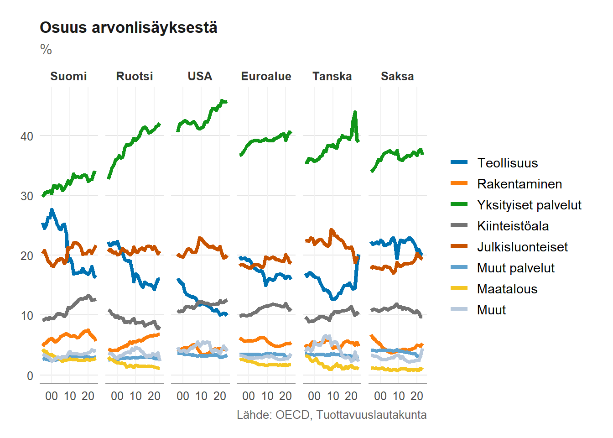

OECD:n tiedoissa on virhe. Muut pitäisi olla nolla, mutta tiedoissa
Teollisuus sisältää vain tehdasteollisuuden.

Näytä koodi

``` r

dat_gva_ind_comb |> 
  filter(time >= "1995-01-01") |> 
  filter_recode(
    measure = c("GVA", "GVAHRS"),
    activity = c("_T", "BTE", "F", "GTNXL", "BTNXL", "L", "OTQ", "RTU", "A"),
    vars = c("cp")
  ) |> 
  spread(activity, values) |> 
  rowwise() |> 
  mutate(Muut = `_T` - sum(c_across(all_of(c("A", "BTE", "F", "GTNXL", "L", "OTQ", "RTU"))), na.rm = TRUE),
         Muut = if_else(Muut == `_T`, NA, Muut)) |> 
  ungroup() |> 
  pivot_longer(where(is.numeric), names_to = "activity", values_to = "values") |> 
  spread(measure, values) |> 
  mutate(HRS = GVA / GVAHRS) |> 
  select(-GVA, -GVAHRS) |> 
  pivot_longer(HRS, names_to = "measure", values_to = "values") |> 
  mutate(values = 100 * values / values[activity == "_T"] , .by = !c(activity, values)) |> 
  filter_recode(
    geo = geos,
activity = c("Teollisuus" = "BTE", "Rakentaminen" = "F","Yksityiset palvelut" = "GTNXL", "Kiinteistöala" = "L", "Julkisluonteiset" = "OTQ", "Muut palvelut" = "RTU", "Maatalous" = "A", "Muut")) |> 
  ggplot(aes(time, values, colour = activity)) +
  facet_wrap(~ geo, nrow = 1) +
  geom_line() +
  scale_x_date(date_labels = "%y") +
  the_title_blank("xyl") +
  labs(
    title = "Osuus työtunneista",
    subtitle = "%",
    caption = "Lähde: Eurostat, OECD, Tuottavuuslautakunta"
  ) 
```

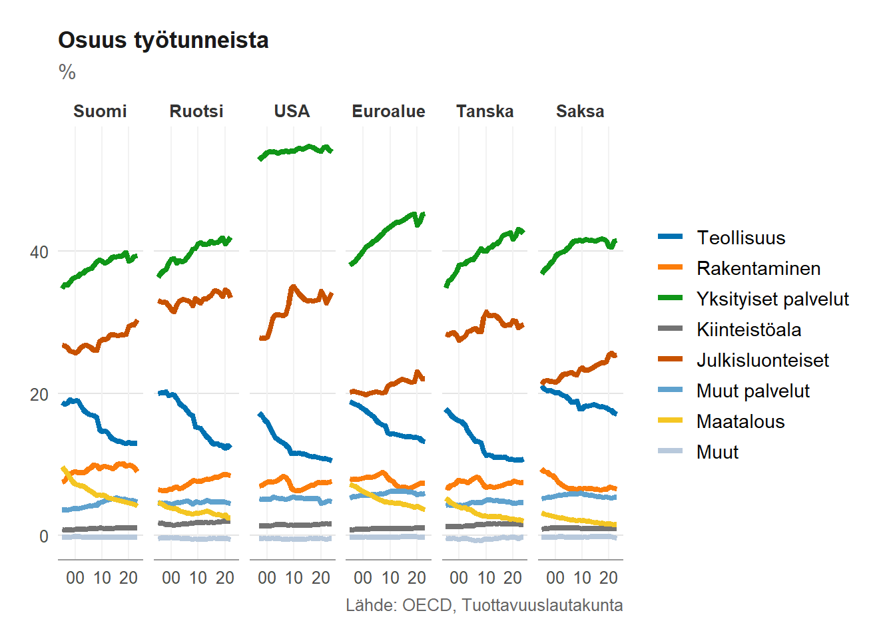

## BKT:n ja tuottavuuden taso

BKT:n ja tuottavuuden kasvua on helpompi vertailla kuin tasoa, sillä
maissa on eri hintasot ja myös valuuttakurssit vaihtelevat paljon.

Näytä koodi

``` r

dat_gdp_main |> 
  filter(time >= "1995-01-01") |> 
  filter_recode(
    measure = c("GDPPOP"),
    activity = c("Koko talous" = "_T"),
    price_base = c("LR"),        # 
    conversion_type = c("PPP")
  ) |> 
  mutate(geo2 = suppressWarnings(fct_relevel(geo, geos, after = Inf))) |>
  mutate(geo = fct_other(geo, keep = geos, other_level = "Other")) |> 
  filter_recode(geo = geos) |> 
  select(-unit_measure) |> 
  ggplot(aes(time, values, group = geo2, colour = geo, linewidth = geo)) +
  geom_line() +
  scale_colour_manual(values = geos_colour) +
  scale_linewidth_manual(values = geos_width) +
  scale_y_log10(breaks = y_log_breaks) +
  guides(colour = guide_legend(reverse = TRUE), linewidth = guide_legend(reverse = TRUE)) +
  the_title_blank("xyl") +
  labs(
    title = "BKT suhteessa väestöön",
    subtitle = "Vuoden 2020 $ hinnoin ostovoimakorjattuna (log-asteikko)",
    caption = "Lähde: Eurostat, OECD, Tuottavuuslautakunta"
  )
```

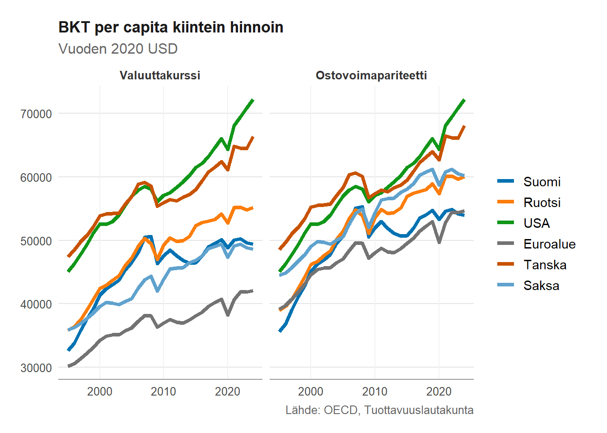

Näytä koodi

``` r

# ggptt::ggsave_ppt_half("bkt_capita", plot = last_plot() filter(p@data, geo != "Tanska") +theme_vm() +the_title_blank("xyl"))

# last_plot()$data |> filter(geo != "muut")  |> select(geo, time, values) |> spread(geo, values) |> conc()
```

### Kiintein hinnoin valuuttakurssilla ja ostovoimakorjattuna

Perusvuosi 2020

Näytä koodi

``` r

dat_gdp_main |> 
  filter(time >= "1995-01-01") |> 
  filter_recode(
    measure = c("GDPPOP"),
    activity = c("Koko talous" = "_T"),
    price_base = c("LR"), 
    unit_measure = c("XDC_PS", "USD_PPP_PS"),
    conversion_type = c(MP = "_Z","PPP")
  ) |> 
  select(-unit_measure,  -var_id) |> 
  spread(conversion_type, values) |>
  # Jostain syystä OECD:n tietokannassa ei ole USA:n markkinahintaista dataa, mutta se on sama kuin PPP, koska PPP on suhtesssa USAan
  mutate(MP = if_else(geo == "US", PPP, MP)) |>
  mutate(MP = convert_currency(MP, geo, time, to = "USD", base_time = "2020-01-01")) |> 
  pivot_longer(where(is.numeric), names_to = "conversion_type", values_to = "values") |>
  filter_recode(
    geo = geos,
    conversion_type = c("Valuuttakurssi" = "MP", "Ostovoimapariteetti" ="PPP")
  ) |>
  ggplot(aes(time, values, colour = geo, linewidth = geo)) +
  facet_wrap(~ conversion_type) +
  geom_line() +
  scale_colour_manual(values = geos_colour) +
  scale_linewidth_manual(values = geos_width) +
  scale_y_log10(breaks = y_log_breaks) +
  guides(colour = guide_legend(reverse = TRUE), linewidth = guide_legend(reverse = TRUE)) +
  the_title_blank("xyl") +
  labs(
    title = "BKT per capita kiintein hinnoin",
    subtitle = "Vuoden 2020 USD (log-asteikko)",
    caption = "Lähde: Eurostat, OECD, Tuottavuuslautakunta"
  )
```

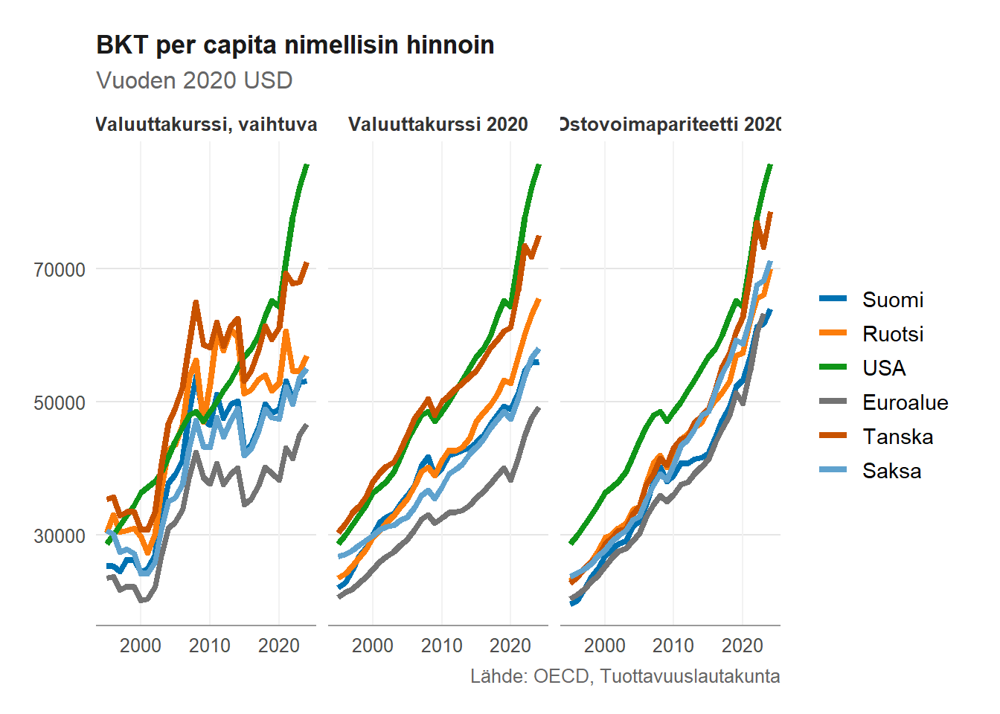

### Käyvin hinnoin valuuttakurssilla ja ostovoimakorjattuna

Näytä koodi

``` r

dat_gdp_main |> 
  filter(time >= "1995-01-01") |> 
  filter_recode(
     measure = c("GDPPOP"),
    activity = c("Koko talous" = "_T"),
    price_base = c("V"),   
    unit_measure = c("XDC_PS", "USD_PPP_PS"), 
    conversion_type = c(MP = "_Z","PPP")
  ) |> 
  select(-unit_measure,  -var_id) |> 
  spread(conversion_type, values) |> 
  # Jostain syystä OECD:n tietokannassa ei ole USA:n markkinahintaista dataa, mutta se on sama kuin PPP, koska PPP on suhtesssa USAan
  # mutate(MP = if_else(geo == "US", PPP, MP)) |> 
  mutate(MP1 = convert_currency(MP, geo, time, to = "USD", base_time = "2020-01-01")) |>
  mutate(MP2 = convert_currency(MP, geo, time, to = "USD")) |> 
  select(-MP) |> 
  pivot_longer(where(is.numeric), names_to = "conversion_type", values_to = "values") |> 
  filter_recode(
    geo = geos,
    conversion_type = c("Valuuttakurssi, vaihtuva" = "MP2","Valuuttakurssi 2020" = "MP1" , "Ostovoimapariteetti 2020" ="PPP")
  ) |>
  ggplot(aes(time, values, colour = geo, linewidth = geo)) +
  facet_wrap(~ conversion_type) +
  geom_line() +
  scale_colour_manual(values = geos_colour) +
  scale_linewidth_manual(values = geos_width) +
  scale_y_log10(breaks = y_log_breaks) +
  guides(colour = guide_legend(reverse = TRUE), linewidth = guide_legend(reverse = TRUE)) +
  the_title_blank("xyl") +
  labs(
    title = "BKT per capita nimellisin hinnoin",
    subtitle = "Vuoden 2020 USD (log-asteikko)",
    caption = "Lähde: Eurostat, OECD, Tuottavuuslautakunta"
  )
```

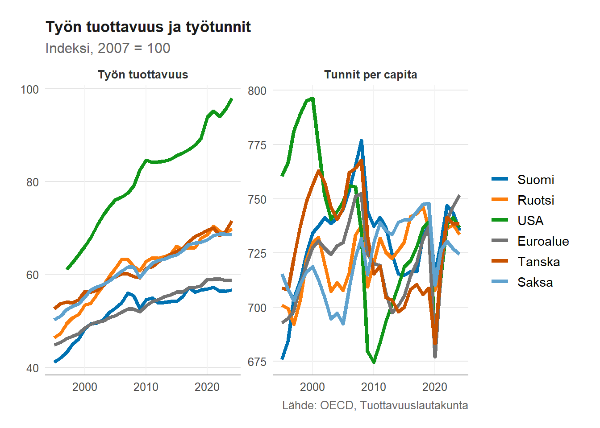

## Tuottavuuden ja työtuntien tasoero

Selittyykö BKT taso eroa tuottavuudella vai työtunneilla.

Työn tuottavuudelle OECD:n tietokannassa on arvonlisäys per työtunnit
-muuttuja ja työtunneille työtunnit per capita -muuttuja.

Selkeästi tasoero tulee työn tuottavuudesta, ei työtunneista. Työn
tuottavuuden taso ero Yhdysvaltoihin on kuitenkin paljon suurempi kuin
BKT per capita, vaikka työntunnit per capita on melkein sama. Miksi
näin?

Näytä koodi

``` r

dat_gdp_main |> 
  filter(time >= "1995-01-01") |> 
  filter_recode(
    geo = geos,
    measure = c("GDP", "HRS", "HRSPOP", "EMP", "POP", "WAP"),
    activity = c("Koko talous" = "_T"),
    unit_measure = c("USD_PPP", "H", "H_PS", "PS"),
    price_base = c("LR", "_Z"),        
    conversion_type = c("PPP", "_Z")
  ) |> 
  select(time, geo, measure, values) |> 
  pivot_wider(names_from = "measure", values_from = "values") |> 
  mutate(
    time = time,
    geo = geo,
    "BKT per työtunnit" = GDP / HRS,
    "TYötunnit per väestö" = HRS / POP,
    .keep = "none") |> 
  pivot_longer(!c("time", "geo"), names_to = "measure", values_to = "values") |> 
  ggplot(aes(time, values, colour = geo, linewidth = geo)) +
  facet_wrap(~measure, scales = "free") +
  geom_line() +
  scale_colour_manual(values = geos_colour) +
  scale_linewidth_manual(values = geos_width) +
  scale_y_log10(breaks = y_log_breaks) +
  guides(colour = guide_legend(reverse = TRUE), linewidth = guide_legend(reverse = TRUE)) +
  the_title_blank("xyl") +
  labs(
    title = "Työn tuottavuus ja työtunnit",
    subtitle = "Indeksi, 2007 = 100 (log-asteikko)",
    caption = "Lähde: Eurostat, OECD, Tuottavuuslautakunta"
  )
```

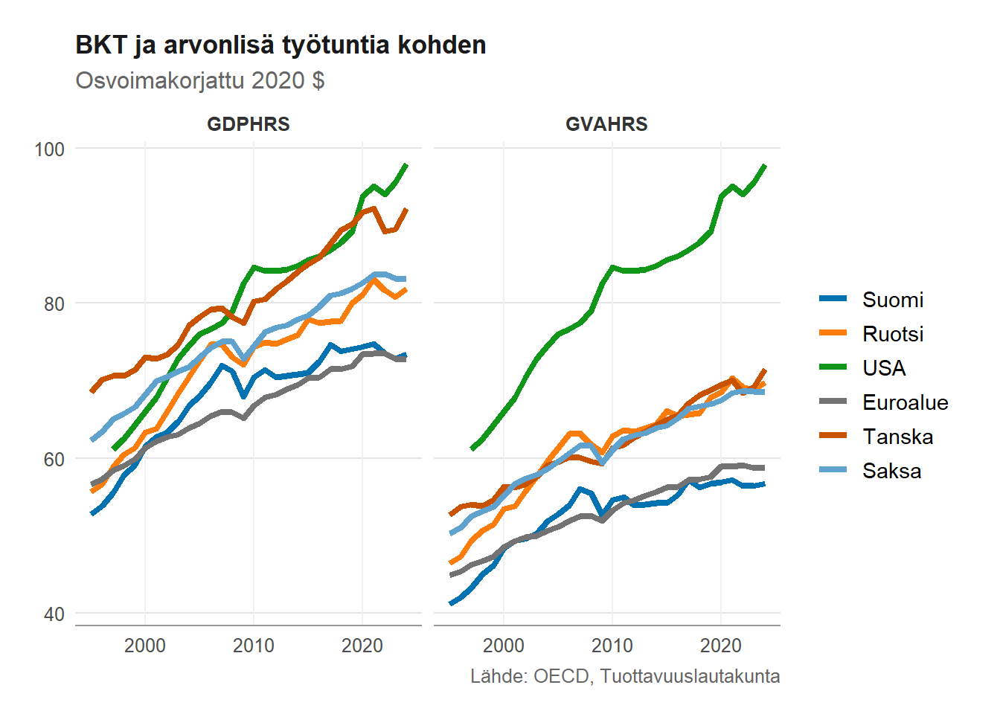

Syy tähän on Yhdysvaltojen ja Eurostatin erilainen tilastointikäytäntö.
BKT työtuntia kohden näyttää erojen osalta samanlaiselta kuin BKT per
capita. Arvonlisä työtuntia kohden on sen sijaan Yhdysvalloissa selvästi
korkeampi kuin EU maissa.

Eurooppalaisessa tilinpidossa BKT = arvonlisä + tuoteverot -
tukipalkkiot. Yhdysvalloissa BKT ja arvonlisä ovat samoja ja tuoteverot
ja tukipalkkiot lasketaan mukaan jo arvonlisätasolla.

Näytä koodi

``` r

dat_gdp_main |> 
  filter(time >= "1995-01-01") |> 
  filter(var_id %in% c("GVAHRS-USD_PPP_H-LR-PPP", 
                       "GDP-USD_PPP-LR-PPP", 
                       "GVA-USD_PPP-LR-PPP", 
                       "HRSPOP-H_PS-_Z-_Z")) |> 
  filter_recode(
    geo = geos,
    measure = c("GVAHRS", "GDP", "GVA", "HRSPOP"),
    activity = c("Koko talous" = "_T"),
    unit_measure = c("USD_PPP_H", "USD_PPP", "H_PS"),
    price_base = c("LR", "_Z"),        
    conversion_type = c("PPP", "_Z")
  ) |> 
  select(time, geo, measure, values) |> 
  spread(measure, values) |> 
  mutate(HRS = GVA / GVAHRS,
         GDPHRS = GDP / HRS) |> 
  pivot_longer(where(is.numeric), names_to = "measure", values_to = "values") |> 
  filter_recode(
    measure = c("GDPHRS", "GVAHRS")
  ) |> 
  ggplot(aes(time, values, colour = geo, linewidth = geo)) +
  facet_wrap(~measure, scales = "free") +
  geom_line() +
  scale_colour_manual(values = geos_colour) +
  scale_linewidth_manual(values = geos_width) +
  scale_y_log10(breaks = y_log_breaks) +
  guides(colour = guide_legend(reverse = TRUE), linewidth = guide_legend(reverse = TRUE)) +
  the_title_blank("xyl") +
  labs(
    title = "BKT ja arvonlisä työtuntia kohden",
    subtitle = "Osvoimakorjattu 2020 $ (log-asteikko)",
    caption = "Lähde: Eurostat, OECD, Tuottavuuslautakunta"
  )
```

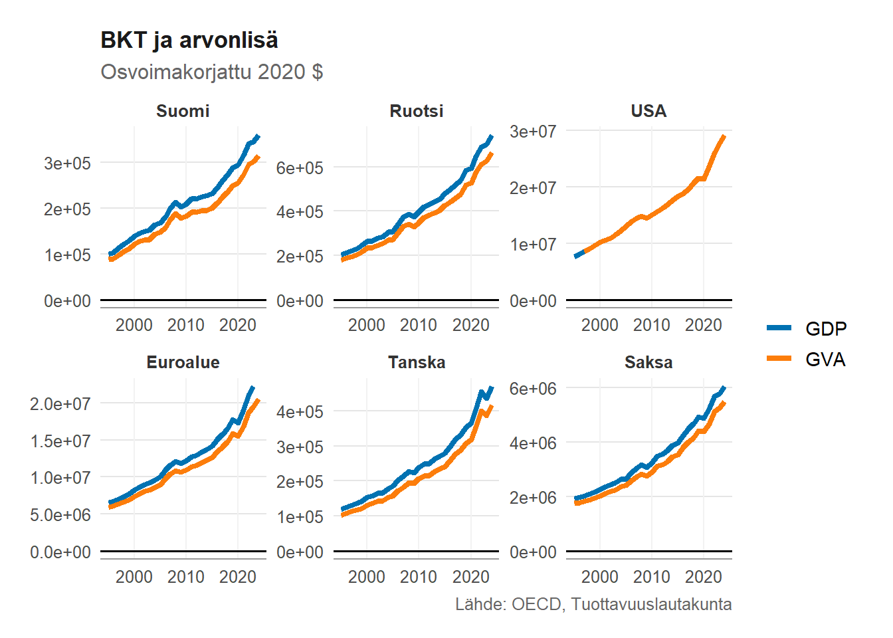

Näytä koodi

``` r

dat_gdp_main |> 
  filter(time >= "1995-01-01") |> 
  filter_recode(
    geo = geos,
    measure = c("GDP", "GVA"),
    activity = c("Koko talous" = "_T"),
    # unit_measure = c("USD_PPP"),
    price_base = c("V") ,        
    conversion_type = c("PPP")
  ) |> 
  select(-unit_measure) |> 
  ggplot(aes(time, values, colour = measure)) +
  facet_wrap(~geo, scales = "free") +
  geom_line() +
  scale_y_log10(breaks = y_log_breaks) +
  the_title_blank("xyl") +
  labs(
    title = "BKT ja arvonlisä",
    subtitle = "Osvoimakorjattu 2020 $ (log-asteikko)",
    caption = "Lähde: Eurostat, OECD, Tuottavuuslautakunta"
  ) +
  geom_hline(yintercept = 0)
```

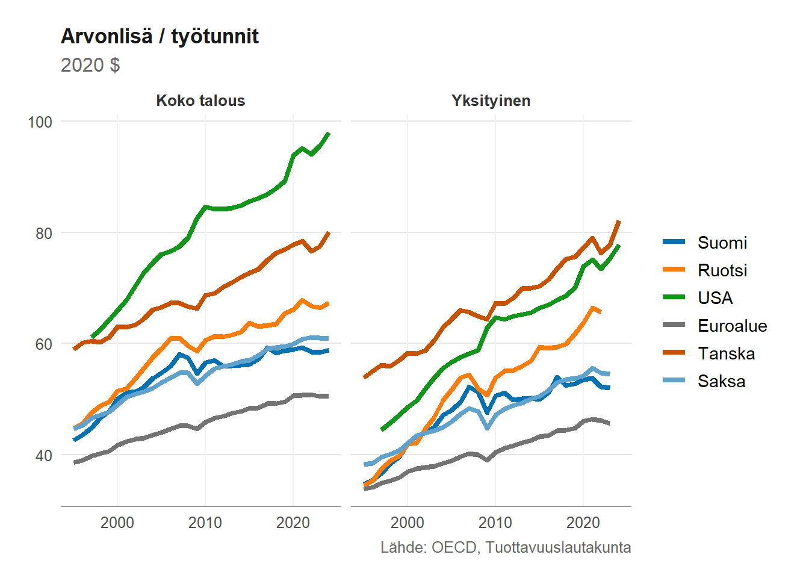

BKT:ta voidaan käyttää vai koko talouden osalta. Arvonlisää täytyy
käyttää, jos taloutta tarkastellaa toimialoittain tai
toimialaryhmittäin.

Yksityisen sektorin tuottavuuserot eivät ole yhtä suuria, vaikka
käytettäisiin arvonlisää.

Yksityisellä sektorilla tarkoitetaan OECD:n tilastossa kohtuullisen
luotettavasti mitattavaa osaa taloudesta ja siihen sisältyvät toimialat
laajasta teollisuudesta (B, C, E, D), rakentaminen (F) ja
markkinapalvelut (G-N pl. L). Siitä jää ulkopuolelle siis maatalous,
kiinteistöala, julkisluonteiset palvelut (eli julkinen hallnto, koulutus
sekä sosiaali- ja terveyspalvelut. Myös näihin sisältyvät yksitykset
palvelut) sekä pienet palvelualat (R, S, T).

Näytä koodi

``` r

dat_gdp_main |> 
  filter(time >= "1995-01-01") |> 
  filter_recode(
    measure = c("GVAHRS"),
    activity = c("Koko talous" = "_T", "Yrityssektori" = "BTNXL"),
    price_base = c("LR"),        # 
    conversion_type = c("_Z")
  ) |> 
  # group_by(across(where(is.factor))) |> 
  # mutate(values = rebase(values, time, 2005)) |> 
  # ungroup() |> |> 
  mutate(values = convert_currency(values, geo, time, to = "USD", base_time = "2020-01-01")) |>   filter_recode(
    geo = geos
  )|> 
  ggplot(aes(time, values, colour = geo, linewidth = geo)) +
  facet_wrap(~ activity) +
  geom_line() +
  scale_colour_manual(values = geos_colour) +
  scale_linewidth_manual(values = geos_width) +
  scale_y_log10(breaks = y_log_breaks) +
  guides(colour = guide_legend(reverse = TRUE), linewidth = guide_legend(reverse = TRUE)) +
  the_title_blank("xyl") +
  labs(
    title = "Arvonlisä / työtunnit",
    subtitle = "2020 $ (log-asteikko)",
    caption = "Lähde: Eurostat, OECD, Tuottavuuslautakunta"
  ) 
```

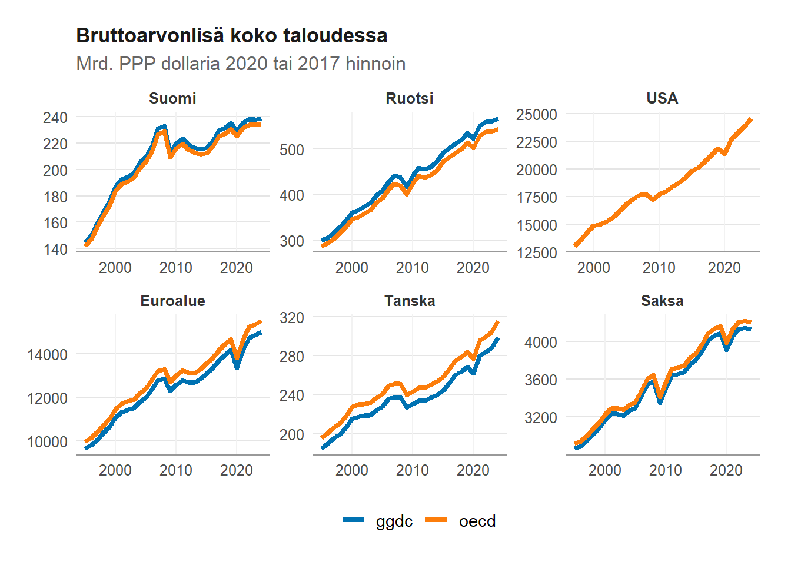

## OECD ja GGDC ero PPP:ssä

Toimialoittaiset tiedot on hintatasokorjattu käyttämällä GGDC:n
Productivity level dabase:n tietoja toimialoittaisista PPP
hintatasoista. OECD:n tietokannassa ei ole ostovoimakorjattuja sarjoja
toimialaoille.

Koko talouden ja toimialaryhmien hinnat on aggregoitu
arvonlisäpainotettuina keskiarvoina. Seuraavassa on tarkasteltu
hintatasokorjatun bruttoarvonlisän eroja koko talouden tasolla OECD:n ja
GGDC:n PPP tiedoilla laskettuna.

Sarjoissa kuuluukin olla pieni ero, koska OECD:n perusvuosi on 2020 ja
GGDC:n 2017. Tarkastelluilla mailla erot selittyvät juuri perusvuodella.

Molemmat sarjat tulevat nyt samasta yhdistetystä volyymiaineistosta,
joten ero on puhtaasti hintatasokorjauksen lähteestä ja perusvuodesta.

Näytä koodi

``` r

# 
# dat_gva_ind_comb |> str()
# dat_gdp_main |> str()

dat1 <- dat_gdp_main |> 
  filter(time >= "1995-01-01") |> 
  filter_recode(
    geo = geos,
    measure = c("GVA"),
    activity = c("_T"),
    price_base = c("LR"),        # 
    conversion_type = c("PPP")
  ) |> 
  select(time, geo, values) |> 
  mutate(ppp_source = "oecd")
  
dat2 <- dat_gva_ind_comb |> 
  filter(time >= "1995-01-01") |> 
  filter_recode(
    geo = geos,
    measure = c("GVA"),
    activity = c("_T"),
    vars = "fp_2020_ppp17"
  ) |> 
  select(time, geo, values) |> 
  mutate(ppp_source = "ggdc")

bind_rows(dat1, dat2) |> 
  mutate(values = values / 1000) |> 
  ggplot(aes(time, values, colour = ppp_source)) +
  facet_wrap(~geo, scales = "free") +
  geom_line() +
  scale_y_log10(breaks = y_log_breaks) +
  the_title_blank("xyl") +
  the_legend_bot() +
  labs(title = "Bruttoarvonlisä koko taloudessa",
       subtitle = "Mrd. PPP dollaria 2020 tai 2017 hinnoin (log-asteikko)")
```

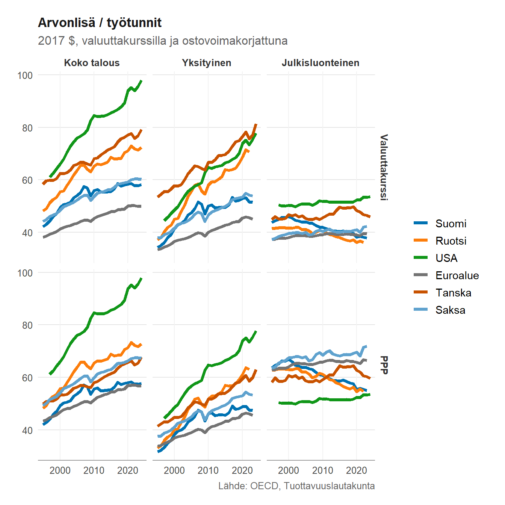

## Työn tuottavuuden tasot toimialoilla

### Yrityssektori

Näytä koodi

``` r

dat_gva_ind_comb|> 
  filter(time >= "1995-01-01") |> 
  filter_recode(
    measure = c("GVAHRS"),
    activity = c("Yrityssektori" = "BTNXL"),
    vars = c(PPP = "fp_2020_ppp17")
  ) |> 
  # mutate(values = rebase(values, time, baseyear = 2007), .by = where(is.factor)) |> 
  filter_recode(
    geo = geos
  ) |> 
  ggplot(aes(time, values, colour = geo, linewidth = geo)) +
  # scale_y_log10(limits = c(50, 150), breaks = y_log_breaks) +
  # facet_grid(vars ~ activity) +
  geom_line() +
  scale_colour_manual(values = geos_colour) +
  scale_linewidth_manual(values = geos_width) +
  scale_y_log10(breaks = seq.int(10, 200, 10)) +
  guides(colour = guide_legend(reverse = TRUE), linewidth = guide_legend(reverse = TRUE)) +
  the_title_blank("xyl") +
  labs(
    title = "Arvonlisä / työtunnit",
    subtitle = "Vuoden 2017 $, ostovoimakorjattuna, logaritminen asteikko, log-asteikko",
    caption = "Lähde: Eurostat, OECD, GGDC, Tuottavuuslautakunta"
  )
```

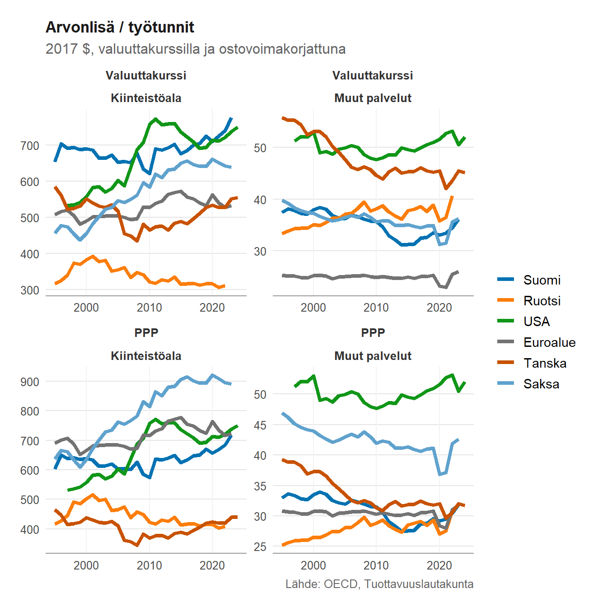

### Vertailus ostovoimakorjattu ja valuuttakurssi

Näytä koodi

``` r

dat_gva_ind_comb|> 
  filter(time >= "1995-01-01") |> 
  filter_recode(
    measure = c("GVAHRS"),
    activity = c("Koko talous" = "_T", "Yrityssektori" = "BTNXL", "Julkisluonteinen" = "OTQ"),
    vars = c(Valuuttakurssi = "fp_2020_xr17", PPP = "fp_2020_ppp17")
  ) |> 
  # mutate(values = rebase(values, time, baseyear = 2007), .by = where(is.factor)) |> 
  filter_recode(
    geo = geos
  ) |> 
  ggplot(aes(time, values, colour = geo, linewidth = geo)) +
  # scale_y_log10(limits = c(50, 150), breaks = y_log_breaks) +
  facet_grid(vars ~ activity) +
  geom_line() +
  scale_colour_manual(values = geos_colour) +
  scale_linewidth_manual(values = geos_width) +
  scale_y_log10(breaks = y_log_breaks) +
  guides(colour = guide_legend(reverse = TRUE), linewidth = guide_legend(reverse = TRUE)) +
  the_title_blank("xyl") +
  labs(
    title = "Arvonlisä / työtunnit",
    subtitle = "2017 $, valuuttakurssilla ja ostovoimakorjattuna (log-asteikko)",
    caption = "Lähde: Eurostat, OECD, Tuottavuuslautakunta"
  )
```

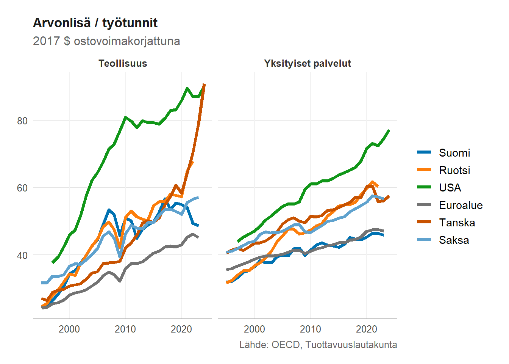

Näytä koodi

``` r

dat_gva_ind_comb|> 
  filter(time >= "1995-01-01") |> 
  filter_recode(
    measure = c("GVAHRS"),
    activity = c("Kiinteistöala" = "L", "Muut palvelut" = "RTU"),
    vars = c(Valuuttakurssi = "fp_2020_xr17", PPP = "fp_2020_ppp17")
  ) |> 
  # mutate(values = rebase(values, time, baseyear = 2007), .by = where(is.factor)) |> 
  filter_recode(
    geo = geos
  ) |> 
  ggplot(aes(time, values, colour = geo, linewidth = geo)) +
  # scale_y_log10(limits = c(50, 150), breaks = y_log_breaks) +
  facet_wrap(vars ~ activity, scales = "free") +
  geom_line() +
  scale_colour_manual(values = geos_colour) +
  scale_linewidth_manual(values = geos_width) +
  scale_y_log10(breaks = y_log_breaks) +
  guides(colour = guide_legend(reverse = TRUE), linewidth = guide_legend(reverse = TRUE)) +
  the_title_blank("xyl") +
  labs(
    title = "Arvonlisä / työtunnit",
    subtitle = "2017 $, valuuttakurssilla ja ostovoimakorjattuna (log-asteikko)",
    caption = "Lähde: Eurostat, OECD, Tuottavuuslautakunta"
  ) 
```

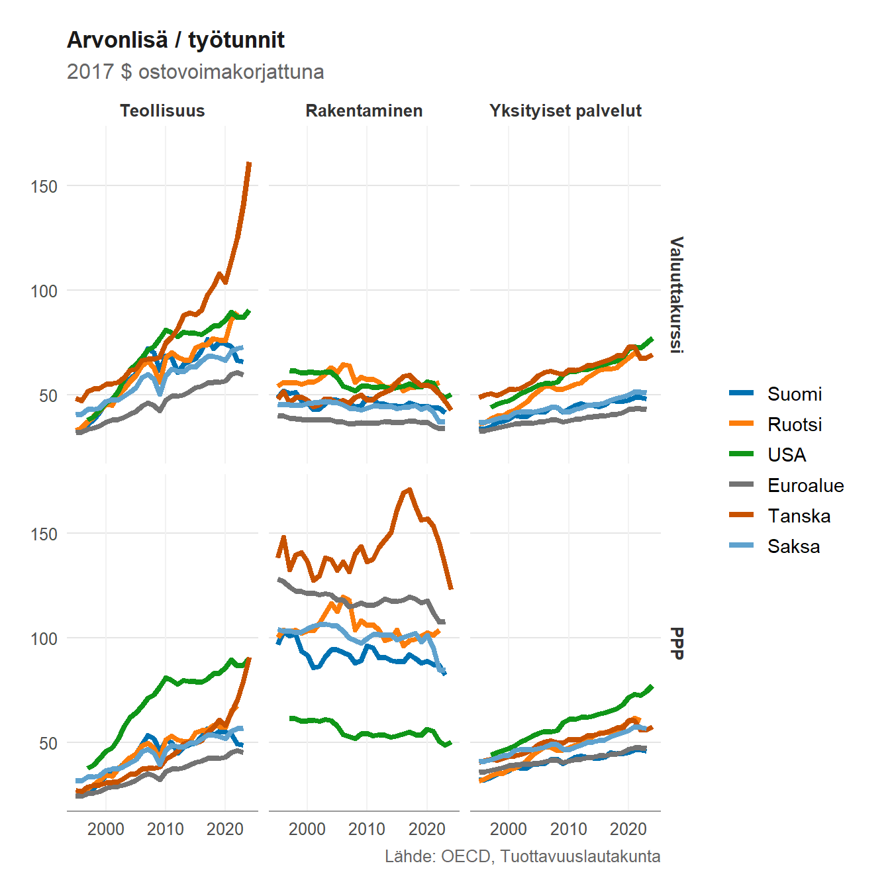

Näytä koodi

``` r

dat_gva_ind_comb|> 
  filter(time >= "1995-01-01") |> 
  filter_recode(
    measure = c("GVAHRS"),
    activity = c("Teollisuus" = "BTE","Yksityiset palvelut" = "GTNXL"),
    vars = c("fp_2020_ppp17")
  ) |> 
  # mutate(values = rebase(values, time, baseyear = 2007), .by = where(is.factor)) |> 
  filter_recode(
    geo = geos
  ) |> 
  ggplot(aes(time, values, colour = geo, linewidth = geo)) +
  # scale_y_log10(limits = c(50, 150), breaks = y_log_breaks) +
  facet_wrap(~ activity) +
  geom_line() +
  scale_colour_manual(values = geos_colour) +
  scale_linewidth_manual(values = geos_width) +
  scale_y_log10(breaks = y_log_breaks) +
  guides(colour = guide_legend(reverse = TRUE), linewidth = guide_legend(reverse = TRUE)) +
  the_title_blank("xyl") +
  labs(
    title = "Arvonlisä / työtunnit",
    subtitle = "2017 $ ostovoimakorjattuna (log-asteikko)",
    caption = "Lähde: Eurostat, OECD, Tuottavuuslautakunta"
  ) 
```


Näytä koodi

``` r

dat_gva_ind_comb|> 
  filter(time >= "1995-01-01") |> 
  filter_recode(
    measure = c("GVAHRS"),
    activity = c("Teollisuus" = "BTE", "Rakentaminen" = "F", "Yksityiset palvelut" = "GTNXL"),
    vars = c(Valuuttakurssi = "fp_2020_xr17", PPP = "fp_2020_ppp17")
  ) |> 
  # mutate(values = rebase(values, time, baseyear = 2007), .by = where(is.factor)) |> 
  filter_recode(
    geo = geos
  ) |> 
  ggplot(aes(time, values, colour = geo, linewidth = geo)) +
  # scale_y_log10(limits = c(50, 150), breaks = y_log_breaks) +
  facet_grid(vars ~ activity) +
  geom_line() +
  scale_colour_manual(values = geos_colour) +
  scale_linewidth_manual(values = geos_width) +
  scale_y_log10(breaks = y_log_breaks) +
  guides(colour = guide_legend(reverse = TRUE), linewidth = guide_legend(reverse = TRUE)) +
  the_title_blank("xyl") +
  labs(
    title = "Arvonlisä / työtunnit",
    subtitle = "2017 $ ostovoimakorjattuna (log-asteikko)",
    caption = "Lähde: Eurostat, OECD, Tuottavuuslautakunta"
  ) 
```


